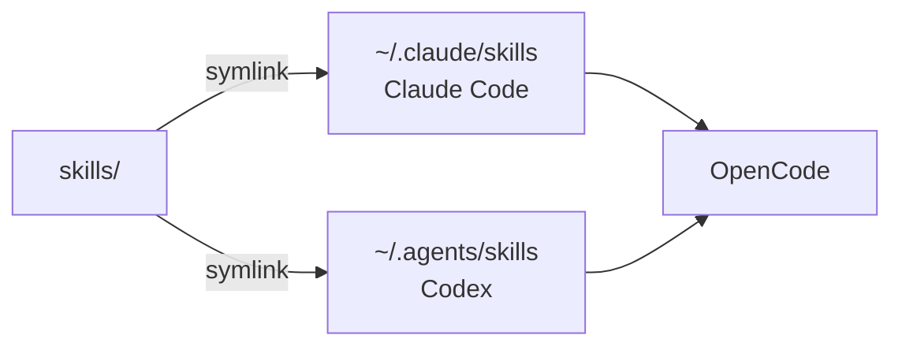

# agent-config

[skillshare](https://github.com/runkids/skillshare) 的設定目錄（`~/.config/skillshare`），整個目錄進版控
（`git_root: root`）。三台機器共用同一份：Claude Code、Codex、OpenCode 的 skills 和 MCP 都從這裡來。

**公開 repo。** 秘密不進來：MCP 的 key 用 `fromEnv`，skill 的 token 放 `~/.config/<skill>/.env`。

## 裡面有什麼

```text
mcp.yaml              三個 client 共用的 MCP server
skills/
  .metadata.json      第三方 skill 從哪裝、哪個 commit（skillshare update --all 讀它）
  <名字>/SKILL.md     自己寫的 + 第三方裝進來的，都在這層
tests/                自己寫的 skill 的 script 測試
```

`config.yaml` 故意不進版控（`.gitignore`），由 dotfiles 用 chezmoi 放好。它只有 source 路徑和
targets，沒有 skill 清單。

## skill 會出現在哪



OpenCode 兩個目錄都會掃，所以沒有另設 target（設了會同一支出現三次）。

`skillshare status` 裡的 **local** 指 target 目錄裡不是 skillshare 放的東西，不是「自己寫的 skill」。

## 怎麼用

新機器、日常新增／更新、MCP 怎麼寫進各 client，都在 dotfiles 的
[docs/ai-agent-setup.md](https://github.com/henry5720/dotfiles/blob/main/docs/ai-agent-setup.md)，這裡不重寫一份。

改完要推：`skillshare push`；其他機器：`skillshare pull`，接著 `skillshare sync mcp -g`。

## 測試

```bash
python3 -m unittest discover -s tests
```
