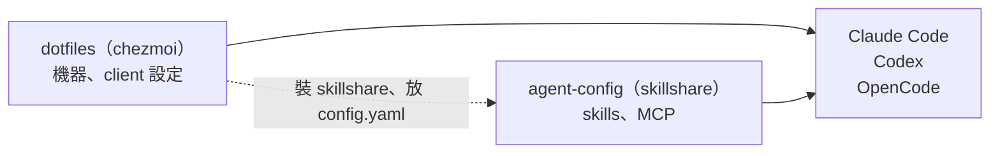
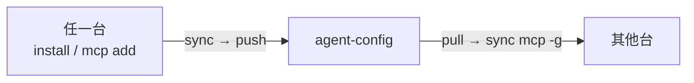

# agent-config

[skillshare](https://github.com/runkids/skillshare) 的設定目錄（`~/.config/skillshare`），整個目錄進版控
（`git_root: root`）。三台機器共用同一份：Claude Code、Codex、OpenCode 的 skills 和 MCP 都從這裡來。



怎麼在新機器裝起來、規則和 client 設定在哪，看
[dotfiles](https://github.com/henry5720/dotfiles/blob/main/docs/ai-agent-setup.md)。
這份只管「裝好之後怎麼用」。詞彙（source、target、local…）見 [CONTEXT.md](CONTEXT.md)。

**公開 repo。** 秘密不進來：MCP 的 key 用 `fromEnv`，skill 的 token 放 `~/.config/<skill>/.env`。

## 裡面有什麼

```text
mcp.yaml              三個 client 共用的 MCP server
skills/
  .metadata.json      第三方 skill 從哪裝、哪個 commit（update --all 讀它）
  <名字>/SKILL.md     自己寫的 + 第三方裝進來的，都在這層
tests/                自己寫的 skill 的 script 測試
```

`config.yaml` 不在 repo 裡：skillshare 的 root 模式會自動 ignore 它，`push` 時就算 commit 了也會被
拿出來，因為它寫的是這台機器的路徑。所以由 dotfiles 用 chezmoi 放（`create_config.yaml`，內容只有
source 路徑和 targets）。以後要不同機器不同配置，改那份就好。

## 日常操作



**skill**

```bash
skillshare list -v                              # 裝了哪些、各自來自哪
skillshare install <帳號>/<repo> -s <名字>        # 裝別人的，只挑這幾個
skillshare update --all                         # 全部照來源更新
skillshare uninstall <名字>
skillshare sync                                 # 同步到 ~/.claude/skills、~/.agents/skills
```

**MCP**

```bash
skillshare mcp list
skillshare mcp add <名字> --url <https://...>   # 或 -- <指令> <參數>；不加 --sync 只存進 mcp.yaml
skillshare sync mcp -g                          # 寫進三個 client，只動自己寫的條目
```

**跨機器**

```bash
skillshare push                                 # 這台改完
skillshare pull && skillshare sync mcp -g       # 其他台；pull 只同步 skill，MCP 要另外 sync
```

進階用法（project 範圍 `-p`、dashboard、audit、`.skillignore`）看
[skillshare 官方文件](https://skillshare.runkids.cc)。

## 選 skill 的原則

**裝進來的每一支，description 每個 request 都會常駐在 context 裡。** 職責重疊的不要裝兩份。

[caveman](https://github.com/JuliusBrussee/caveman) 是例子：它的 repo 有 20 個 skill，只裝了核心的
`caveman`。6 個要 Caveman Cloud 帳號；`investigate-first`、`safe-refactor`、`surgical-patch`、
`lean-build`、`verify-and-stop`、`caveman-explore`、`cavecrew` 跟 mattpocock 那組
（`diagnosing-bugs` / `tdd` / `prototype`）和內建的 `Explore` agent 重疊。

caveman 另外有 proxy（`caveman claude`）和 MCP server，**都沒用**：proxy 會改寫送進模型的內容，
出問題時分不清是模型的問題還是被壓壞了，而且它要換掉 `claude` 的啟動入口。

⚠️ `update` 會**蓋掉手改過的第三方 skill**。要改別人的，先複製成自己的 skill 再改。

## 自己寫的 skill

放 `skills/<名字>/`。skill 要呼叫的 script 放同一個資料夾（例如 slack-list 的 `scripts/`），
裝 skill 就裝到 script。秘密放 `~/.config/<名字>/.env`，repo 裡只留 `.env.example`。

## MCP 的 API key

`mcp.yaml` 只寫 `fromEnv: CONTEXT7_API_KEY`，各 client 設定裡留的也只是參照。值由 dotfiles export
（chezmoi 渲染成 `~/.config/zsh/env.zsh`），所以 agent 要從 zsh 開起來才讀得到。沒填 key，context7
就走匿名額度。

## sync mcp 撞到衝突

skillshare 遇到不是它寫的同名條目會**整批停下**（`existing entry is not managed`），什麼都不寫。

```bash
skillshare sync mcp -g --dry-run                # 先看 conflict 清單
```

逐一決定：

- **照 `mcp.yaml` 的版本**：刪掉 client 裡那條（例如 `claude mcp remove <名字> -s user`）再 sync，
  或在 dashboard 按 **Replace with source**
- **收進 agent-config**：`skillshare mcp import <名字> --from <client>`，再 push
- **跟 `mcp.yaml` 一模一樣**：不會衝突（列為 `unchanged`），但 skillshare 不會認領，之後從
  `mcp.yaml` 拿掉也不會刪。要它接手一樣用 `mcp import`

OpenCode 同時有 `opencode.json` 和只含 `$schema` 的空殼 `opencode.jsonc` 時，sync 會直接拒絕
（`all exist; consolidate them into one file`）。確認空殼只有 `$schema` 就刪掉。

## 測試

```bash
python3 -m unittest discover -s tests
```
