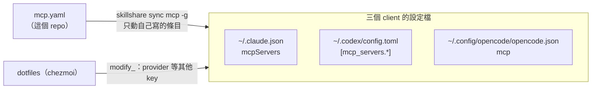

# MCP：三個 client 共用一份

MCP 是讓 agent 連到外部服務的通道 —— 查文件、開瀏覽器、讀 Slack、連資料庫。**跟 skill 是兩回事**：
skill 是步驟說明（純文字），MCP 是真的能對外做事的工具。也是可選的，想接什麼再裝什麼。

指令（加、同步、跨機器）在 [README 的日常操作](../README.md#日常操作)，這份不重寫。

## 誰寫哪一段

**不同 client 不會共用 MCP 設定。** Claude 裝過的 MCP，OpenCode 不會自動載入 —— 跟 skill 不同，
不要因為 OpenCode 讀得到 `~/.claude/skills/` 就以為它也讀 Claude 的 MCP。所以同一份清單
由 skillshare 分別寫進三邊：



同一個檔案兩邊都會寫，但不搶同一個 key：skillshare 只動 MCP 條目，dotfiles 的 `modify_`
只管 provider 等其他 key、MCP 那段原樣留著。**dotfiles 不再寫任何 MCP 條目。**

client 專屬的欄位 skillshare 不寫。例如 Codex 的 `startup_timeout_sec`：啟動逾時就在
`~/.codex/config.toml` 那個 table 手動補，skillshare 會保留它。

## API key

`mcp.yaml` 只寫 `fromEnv`，值從哪來見 [README 的〈MCP 的 API key〉](../README.md#mcp-的-api-key)。
重點是 **agent 要從 zsh 開起來才讀得到**，因為 key 是 dotfiles 渲染成 `~/.config/zsh/env.zsh`
再由 `.zshrc` 載入的。

## 從舊版 dotfiles 升上來的機器

舊版 chezmoi 寫過的 MCP 條目，skillshare 會當成「不是它的」而**整批停下**
（`existing entry is not managed`）。依來源處理：

| 條目從哪來 | 怎麼處理 |
|---|---|
| 舊版 chezmoi 寫的 | `chezmoi apply` 時 dotfiles 的 [`run_once_after_remove-chezmoi-mcp.py.tmpl`](https://github.com/henry5720/dotfiles/blob/main/home/run_once_after_remove-chezmoi-mcp.py.tmpl) 自動刪掉：Claude 的 chrome-devtools；Codex 的 chrome-devtools、codegraph、context7；OpenCode 的 chrome-devtools、codegraph。只刪跟舊版內容一字不差的，Codex 的 context7 例外（key 是各台自己的值，只比對 url 與欄位）。刪掉時會印出來 |
| 舊版 chezmoi 放的 skill | `~/.codex/skills/`、`~/.config/opencode/skills/` 底下的 `company-imagegen-fallback` 已搬來這個 repo，dotfiles 的 `.chezmoiremove` 讓 `chezmoi apply` 把舊的刪掉，不然 Codex 會看到兩份 |
| 手動加的（`claude mcp add`、`codegraph install`）、OpenCode 的空殼 `opencode.jsonc` | 見 [README 的〈sync mcp 撞到衝突〉](../README.md#sync-mcp-撞到衝突) |

順序：

```
chezmoi update → skillshare sync mcp -g --dry-run → 處理 conflict → skillshare sync mcp -g
```

## 個別 server 的細節

現在裝了哪些跑 `skillshare mcp list`，這裡不列清單（會過時）。有坑要記的：

| server | 看哪 |
|---|---|
| chrome-devtools | [docs/skills/chrome-mcp.md](skills/chrome-mcp.md)：桌機要連 Windows 的 Chrome（遠端主機也能自己開 headless Chrome）、要關掉官方 plugin、版本釘在 `mcp.yaml` |
| codegraph | dotfiles 的 [ai-agent-setup.md〈codegraph〉](https://github.com/henry5720/dotfiles/blob/main/docs/ai-agent-setup.md#codegraph設定會回來但它塞進-claudemd-的那段不會)：CLI 安裝、索引、worktree 與 git hook 都由 dotfiles 管 |
