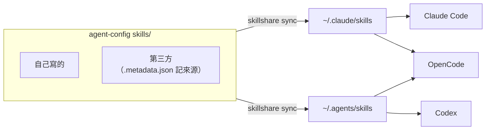
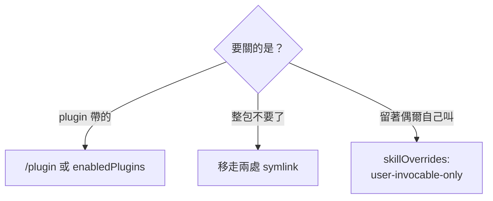

# skill：從哪來、裝給誰、怎麼關

skill 是一套「做某件事的步驟」。本體（SKILL.md 內文）用到才載入，但 **name + description
每個 request 都常駐在 context 裡**（見〈怎麼關〉）。

指令（裝、更新、同步）在 [README 的日常操作](../../README.md#日常操作)，這份不重寫；
這份講背後的安排。

## 從哪來、落到哪

別人的和自己寫的 skill 都放在這個 repo 的 `skills/`，由 skillshare 同步到兩個 target：



OpenCode 自己會掃 `~/.claude/skills/`、`~/.agents/skills/`、`~/.config/opencode/skills/` 和
專案裡對應的目錄，所以**不要給 skillshare 加 OpenCode target**，不然同一支出現三份。

不歸 skillshare 管的例外：

- obsidian-wiki 那包：pip 套件自己連進 `~/.agents/skills`、`~/.codex/skills`
- `~/.claude/skills/synced/`：Claude 自己同步的
- `~/.config/opencode/skills/`：dotfiles 部署的 OpenCode 專用 skill，加上 oh-my-opencode-slim 自己放的
- Claude plugin 帶的 skill：`/plugin` 管

`skillshare status` 的 `N local` 就是落在 target 目錄裡、但不是 skillshare 放的那些，不是錯誤。

herdr 的 skill 釘在跟本機 herdr 同一版（skill 裡的指令要對得上 binary），升 herdr 後要手動跟：

```bash
skillshare install herdrdev/herdr/skills/herdr --branch v<新版> --force && skillshare sync
```

`playwright-cli` 的 skill 同理，釘在跟本機 `@playwright/cli` 同版的上游 commit，升級步驟見
[verify-in-browser.md](verify-in-browser.md#升級-playwright-cli-後跟上-skill)。

## 為什麼第三方 skill 用 skillshare 裝，不手抄

那些檔案是別人 repo 裡的。手抄進來以後，上游改了你不會跟著動；想跟上就得手動比對、貼、
處理衝突。skillshare 裝的會記來源，`skillshare update --all` 照來源更新。

⚠️ 所以**第三方 skill 不要手改**，`update` 會蓋掉。要改就複製成自己的 skill。

## 裝給誰用：global 還是 project

| 範圍 | 位置 | 什麼時候用 |
|---|---|---|
| **global** | `~/.claude/skills/<名字>/`、`~/.agents/skills/<名字>/` | 到處都用得到：查 bug、TDD、寫日誌 |
| **project** | `<那個 repo>/.claude/skills/<名字>/` | 只有這個專案有意義，而且要跟著 repo 給同事 |

判斷只問一句：**這個 skill 講的事，換個 repo 還成立嗎？** project 範圍會進那個 repo 的版控，
同事 clone 就有，但換個專案就沒了。skillshare 用 `-g` / `-p` 切。

## 怎麼關

**description 是常駐成本。** 2026-09 實測：`~/.claude/skills/` 底下 91 個 skill ≈ 9,464 tokens；
砍到 46 個 ≈ 2,612 tokens。

量法：

```bash
cd ~/.claude/skills && tot=0
for d in */; do
  c=$(sed -n '1,/^---$/p' "$d/SKILL.md" | sed -n '2,$p' | head -20 | wc -c)
  tot=$((tot+c))
done
echo "$(ls | wc -l) 個, 約 $((tot/4)) tokens"
```

先看哪些真的用過（掃 session 紀錄的 Skill 呼叫與 slash command）：

```bash
cd ~/.claude/projects
grep -ohE '"skill":"[^"]+"' $(find . -name '*.jsonl') | sort | uniq -c | sort -rn
grep -ohE '<command-name>[^<]+</command-name>' $(find . -name '*.jsonl') | sort | uniq -c | sort -rn
```

### 挑哪個做法



plugin 帶的 skill 只能從 plugin 那層關，移走 symlink 和 `skillOverrides` 都管不到。
兩處 symlink 是 `~/.claude/skills` 和 `~/.agents/skills` 底下那支，都要移。

### 三家各自的關法

| | 機制 | 寫在哪 |
|---|---|---|
| **Claude Code** | `skillOverrides`：`on` / `name-only` / `user-invocable-only` / `off` | `~/.claude/settings.json`。或打 `/skills`，Space 循環狀態、Esc 存進 `settings.local.json` |
| **Codex** | `[[skills.config]]` + `path` + `enabled = false` | `~/.codex/config.toml`，見 dotfiles 的 [`modify_private_config.toml.tmpl`](https://github.com/henry5720/dotfiles/blob/main/home/dot_codex/modify_private_config.toml.tmpl) |
| **OpenCode** | `permission.skill` 設 `"deny"`；整包不要就 `"skill": false` | `~/.config/opencode/opencode.json` |

`skillOverrides` 的四個值差在「Claude 看不看得見」：

| 值 | 進 context | 自動觸發 | 你打 `/名字` |
|---|---|---|---|
| `on`（預設） | name + description | 會 | 可以 |
| `name-only` | 只有 name | 沒實測 | 可以 |
| `user-invocable-only` | 不進 | 不會 | 可以 |
| `off` | 不進 | 不會 | 不行，`/` 選單也沒有 |

⚠️ `skillOverrides` **不吃 glob，要逐條寫名字**，而且**管不到 plugin 帶的 skill**。

### 這台實際怎麼關的：移走 symlink

pip 裝的 obsidian-wiki 那包是 symlink，來源在
`~/.local/share/obsidian-wiki/venv/.../obsidian_wiki/_data/skills/`。停用 = 把 symlink 移到旁邊，
來源套件原封不動：

```bash
mkdir -p ~/.claude/skills-disabled
cd ~/.claude/skills
for s in *; do
  case "$(readlink -f "$s")" in
    */obsidian-wiki/*) mv "$s" ../skills-disabled/;;
  esac
done
```

用 symlink 目標判斷、不寫死名字 —— 套件增刪 skill 時不用回來改。要還原就
`mv ~/.claude/skills-disabled/<名字> ~/.claude/skills/`，重開 client 生效。

⚠️ **只移 `~/.claude/skills` 那份關不掉 OpenCode。** obsidian-wiki 也連進了 `~/.agents/skills`
（OpenCode 同樣會掃），`~/.agents/skills` 也要跑一次同樣的 loop。Codex 的 config.toml 只停用
`~/.codex/skills/*` 那份，`~/.agents/skills` 那份 Codex 看不看得到還沒實測。

停用狀態不在 repo 裡：新機器裝完 skill 會全部是開的，要重跑一次上面的 loop。

## 有人類文件的 skill

只有人要自己動手（跑 script、設定、排錯）的 skill 才有一份：

| skill | 你要做的事 |
|---|---|
| [chrome-mcp](chrome-mcp.md) | 開 Chrome 給 agent 用、轉發到 EC2、排錯 9222 |
| [verify-in-browser](verify-in-browser.md) | 裝 `playwright-cli`、升級後跟上官方 skill；也講瀏覽器工具怎麼分工 |
| [slack-list](slack-list.md) | 建 Slack app、填 `.env`、排錯 |
| [daily-worklog](daily-worklog.md) | 兩種用法：裝成 skill，或整份貼給其他 agent |

其他 skill 只要叫 agent 照做，看它的 `SKILL.md` 就好。
