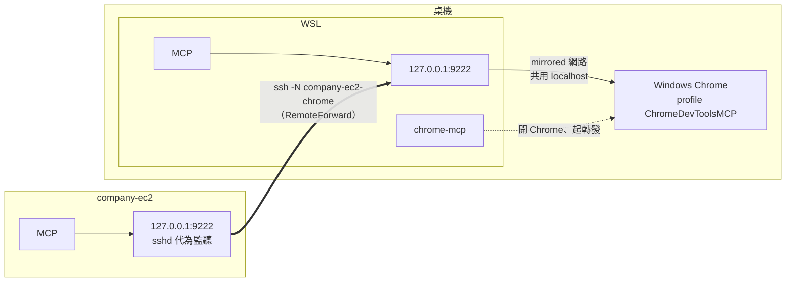
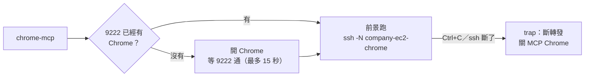
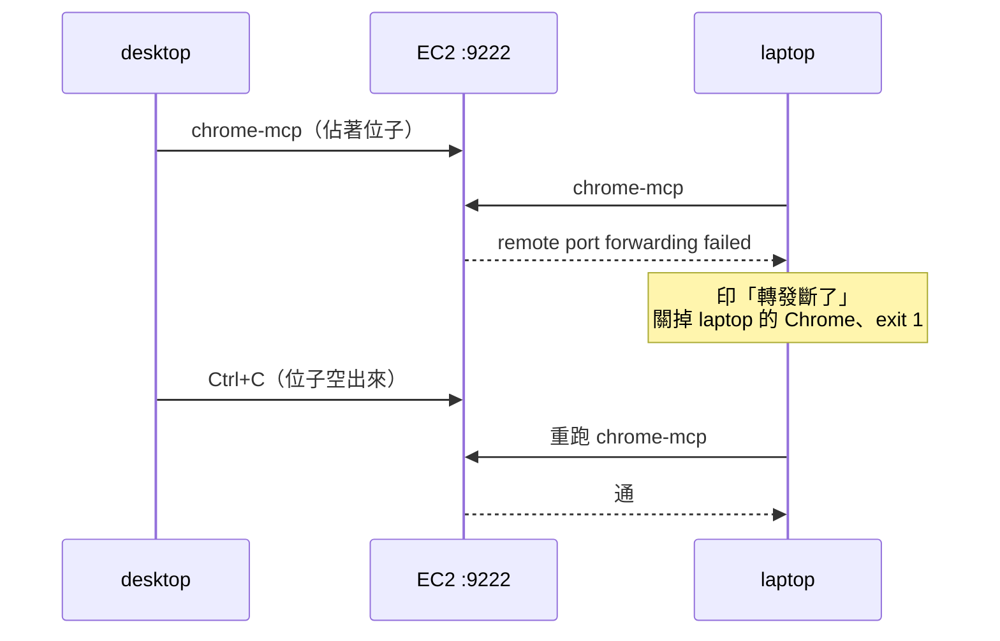
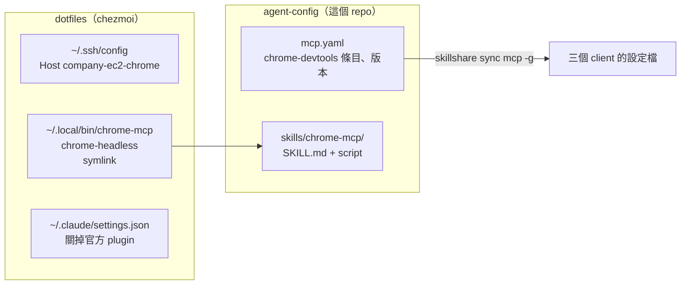

# chrome-mcp：讓 agent 開你的瀏覽器

Claude Code、Codex、OpenCode 都接了 `chrome-devtools-mcp`，agent 因此能開網頁、點按鈕、看
console、抓 network、跑 lighthouse。這份記的是**這幾台機器上為什麼要這樣設**，不是這個 MCP
的用法（用法看[官方 repo](https://github.com/ChromeDevTools/chrome-devtools-mcp)）。

教 agent 怎麼用的是 [`skills/chrome-mcp/SKILL.md`](../../skills/chrome-mcp/SKILL.md)，
script 本體是 [`skills/chrome-mcp/scripts/chrome-mcp`](../../skills/chrome-mcp/scripts/chrome-mcp)，
遠端主機自己開 headless 用的是 [`scripts/chrome-headless`](../../skills/chrome-mcp/scripts/chrome-headless)。

## 全貌

平常 Chrome 開在桌機（desktop 或 laptop）的 Windows 上。WSL 和 EC2 的 MCP 都連
`127.0.0.1:9222`，只是 EC2 那邊要靠 ssh 把 9222 轉回來。EC2 也可以改用自己的
headless Chrome，見〈[EC2：自己開 headless](#ec2自己開-headless)〉。



前提：WSL interop 叫得動 Windows 的 `cmd.exe`／`powershell.exe`、Windows 裝了 Chrome、
`.wslconfig` 是 `networkingMode=mirrored`（見 dotfiles 的
[`wsl/.wslconfig`](https://github.com/henry5720/dotfiles/blob/main/wsl/.wslconfig)）。

> ⚠️ `9222` 等於**完整瀏覽器控制權**，包含那個 profile 裡所有登入狀態。只綁 localhost，
> 不要對 LAN 或網際網路開放。

> ⚠️ **不要在 WSL 裝 Linux Chrome。** `npx puppeteer browsers install chrome` 會抓 80MB 到
> `~/.cache/puppeteer`，然後你有兩個瀏覽器、agent 連的還是錯的那個。

## 怎麼用

```bash
chrome-mcp        # 開 Windows Chrome(9222)+ 轉發到 EC2，停在前景；Ctrl+C 全部關掉
```

它像 server 一樣停在前景：開著就是在用，用完 Ctrl+C。



`~/.local/bin/chrome-mcp` 是 dotfiles 放的 symlink，指到這個 repo 的 script。新機器要等
`skillshare pull` 之後 symlink 才有目標。

**Chrome 要先跑起來，MCP client 才連得上。** Claude Code 在 session 裡 `/mcp` 重連；其他
client 用它自己的 reconnect，`/mcp` 不是通用指令。

### script 做的事，每件都是踩過才加的

1. **先檢查 9222 通不通。** Chrome 已有實例時，再下一次帶參數的啟動會被**轉交給既有實例、
   新參數整組丟掉、而且不報錯**。沒這個檢查就會看到「指令跑完、沒紅字、MCP 還是連不上」。
   9222 上是別的服務（不是 DevTools endpoint）就直接失敗，不會去關既有的 Chrome。
2. **問 Windows 自己的 `%LOCALAPPDATA%`**，不寫死 `C:\Users\henry`。
3. **等 9222 真的通了才往下走**，最多等 15 秒，逾時回傳非零。
4. **轉發跑在前景，結束時收掉 Chrome。** 以前 `ssh -f` 丟背景、沒人收，換台或重開機後
   EC2 的 9222 還被舊連線佔著（2026-10-02，重開機前的死連線佔了兩小時）。結束時一律關
   `ChromeDevToolsMCP` profile 那個 Chrome，不管是不是這次開的 —— 那個 profile 只有它在用。

### 怎麼結束，決定誰收尾

| 怎麼結束的 | 轉發（EC2 的 9222） | MCP Chrome |
|---|---|---|
| Ctrl+C | trap 收掉 | 關掉 |
| 9222 被別台佔著 | ssh 自己退出 | 關掉 |
| 關 herdr pane | 終端機一關 ssh 就斷 | **留著** —— HUP 後整棵 process 立刻被砍，trap 跑不完（`setsid`、double fork 出去的也活不了）。下次跑沿用，結束時一起關 |
| 斷電、重開機 | **沒人收**，要靠 EC2 sshd 的 `ClientAliveInterval` 約 90 秒清掉（見下方 EC2 一節） | 跟著電腦一起沒了 |

## 第一次要手動登入

用的是獨立 profile（`%LOCALAPPDATA%\ChromeDevToolsMCP`），不是你日常那個。原因有兩個：
日常 profile 開著的時候 Chrome 會忽略 `--remote-debugging-port`；而且讓 agent 碰你日常瀏覽的
登入狀態不是好主意。

代價是這個 profile 第一次是全新的，要手動登入你想讓 agent 看到的網站。之後會保留 cookie。

## EC2：用桌機的 Windows Chrome

MCP 設定跟 WSL 那份一樣
（`--browser-url=http://127.0.0.1:9222`），把桌機的 9222 用 ssh 反向轉過去：

```bash
chrome-mcp                                                               # 桌機：開 Chrome + 轉發
ssh company-ec2 'curl -s 127.0.0.1:9222/json/version | grep User-Agent'  # 要看到 Windows NT
```

最後那行一定要看 `User-Agent`。看到 `X11; Linux` 就是連到 WSL 裡別的 Chrome 了（見排錯）。

### 9222 只有一個位子

轉發只放在 `Host company-ec2-chrome`（帶 `ExitOnForwardFailure yes`），一般的
`ssh company-ec2` 和 herdr 的 saved machine 都不帶。以前 `Host company-ec2` 本身帶
RemoteForward，每條連線（每個終端機、herdr、Windows 端的 ssh）都去搶：先連的搶到，
後連的只在 EC2 的 sshd log 留一行 `error: bind [127.0.0.1]:9222: Address already in use`，
連線照常。搶到的那條常常是另一頭沒開 Chrome 的連線（2026-09-30 在 laptop 上就是這樣，
EC2 那邊 Connection refused）。

現在誰的 `chrome-mcp` 開著，位子就是誰的；關掉位子就空出來。換台：



不要「連線前先把 EC2 的 9222 清掉」：EC2 分不出佔著的是死連線還是另一台正在用的，
一律清掉會把正在用的那台砍斷。

### 死連線：EC2 要開 ClientAliveInterval

原本那台沒正常關（斷電、重開機、筆電闔上斷網），EC2 不知道 client 不在了，位子會一直被
死連線佔著。EC2 的 sshd 要開 `ClientAliveInterval`，讓它約 90 秒後自己清掉：

```bash
echo -e 'ClientAliveInterval 30\nClientAliveCountMax 3' | sudo tee /etc/ssh/sshd_config.d/70-client-alive.conf
sudo sshd -t && sudo systemctl reload ssh
```

2026-09-25 在 company-ec2 實測：`chrome-devtools-mcp@1.10.1` 經這條路開頁、列頁、關頁都正常。

## EC2：自己開 headless

EC2 自己開 headless Chrome 佔 9222。MCP 設定一個字都不改 —— 它只認 9222，不管後面是誰。
兩種隨時都能用，看需求挑：

| | headless（`chrome-headless`） | 桌機 Chrome（`chrome-mcp`） |
|---|---|---|
| 看畫面 | 看不到，叫 agent 截圖 | 看得到視窗 |
| 登入狀態 | EC2 自己那份 | 你在桌機登入過的那份 |
| 要你做什麼 | 不用，agent 自己開 | 在桌機 WSL 跑 `chrome-mcp`、終端機開著 |
| 什麼時候用 | 不需要看畫面（一般偵錯、截圖、跑流程），或手邊沒桌機（平板） | 要看著它操作，或要用桌機登入過的網站 |

```bash
chrome-headless                                          # EC2：開 headless Chrome，停在前景；Ctrl+C 關掉
curl -s 127.0.0.1:9222/json/version | grep User-Agent    # 要看到 HeadlessChrome
```

agent 照 SKILL.md 會自己開，不用你動手。看不到畫面，要看就叫它截圖。

**跟桌機輪流用 9222。** 兩邊同時只能有一個：

| 正在跑 | 再開另一個 |
|---|---|
| EC2 的 `chrome-headless` | 桌機的 `chrome-mcp` 轉發失敗（`remote port forwarding failed`）→ 先去 EC2 把 headless Ctrl+C 掉 |
| 桌機的 `chrome-mcp` | `chrome-headless` 看到 9222 已有 Windows Chrome，直接沿用、不開，提示要先關桌機那邊 |

**登入狀態跟桌機不共用。** profile 在 EC2 的 `~/.local/state/chrome-mcp-profile`，關掉再開還在，
但跟桌機 `ChromeDevToolsMCP` 那份是兩份。沒有畫面，要登入的網站讓 agent 自己填表登入。

**安裝**：dotfiles chezmoi 選裝工具選單的 `headless-chrome`；已經 init 過的機器用
`chezmoi edit-config` 把它加進 `tools`，再 `chezmoi apply`。裝 Google 官方 `.deb`，
`fonts-noto-cjk`、`fonts-noto-color-emoji` 也在同一次 `chezmoi apply` 裝 —— 少了字型，截圖裡中文和 emoji 全是方框。
桌機 WSL 的選單不會出現這一項（上面的 ⚠️：WSL 不裝 Linux Chrome）。

## 設定放在哪



MCP server 的定義在這個 repo 的 [`mcp.yaml`](../../mcp.yaml)。`skillshare sync mcp -g`
把它寫進三個 client 各自的設定檔，只動自己寫的那幾個條目：

| client | 寫進哪裡 |
|---|---|
| Claude Code | `~/.claude.json` 的 `mcpServers` |
| Codex | `~/.codex/config.toml` 的 `[mcp_servers.*]` |
| OpenCode | `~/.config/opencode/opencode.json` 的 `mcp` |

新增、改參數、升版本都改 `mcp.yaml`，不要改 dotfiles。三個 client 的參數刻意保持一致：

```
--browser-url=http://127.0.0.1:9222   連 Windows 那台，不要自己開
--no-usage-statistics                 不回報使用統計
--no-performance-crux                 跑效能分析時不去 CrUX API 查別人網站的公開數據
```

dotfiles 管的這幾樣：

| 檔案 | 部署到 | 管什麼 |
|---|---|---|
| [`home/private_dot_ssh/private_config`](https://github.com/henry5720/dotfiles/blob/main/home/private_dot_ssh/private_config) | `~/.ssh/config` | 只有 `Host company-ec2-chrome` 帶 RemoteForward |
| [`home/dot_local/bin/symlink_chrome-mcp.tmpl`](https://github.com/henry5720/dotfiles/blob/main/home/dot_local/bin/symlink_chrome-mcp.tmpl) | `~/.local/bin/chrome-mcp` | 指到這個 repo 的 script |
| [`home/dot_local/bin/symlink_chrome-headless.tmpl`](https://github.com/henry5720/dotfiles/blob/main/home/dot_local/bin/symlink_chrome-headless.tmpl) | `~/.local/bin/chrome-headless` | 同上，EC2 用 |
| [`home/dot_claude/modify_settings.json.tmpl`](https://github.com/henry5720/dotfiles/blob/main/home/dot_claude/modify_settings.json.tmpl) | `~/.claude/settings.json` | 關掉官方 chrome-devtools plugin |

Windows 端的 `C:\Users\henry\.ssh\config` 誰都不管，兩個 Host 要手動保持跟 dotfiles 那份一樣。

### 為什麼要關掉官方那個 plugin

Claude Code 內建一個 chrome-devtools plugin，設定在：

```
~/.claude/plugins/cache/claude-plugins-official/chrome-devtools-mcp/<版本>/.claude-plugin/plugin.json
```

它的 `args` 只有 `["chrome-devtools-mcp@<版本>"]` —— **沒有 `--browser-url`**。所以它會想在
WSL 自己開一個 Chrome，然後失敗：

```
Protocol error (Target.setDiscoverTargets): Target closed
```

不關掉的話它會跟 skillshare 寫的那台 MCP server 同時出現，同一組工具兩份，Claude 有一半機率挑到壞的。
官方裝法（`claude mcp add chrome-devtools npx chrome-devtools-mcp@latest`）也生不出正確設定，
少的就是 `--browser-url`，所以參數要記在 `mcp.yaml`，不能靠重跑 installer。

## 排錯

| 症狀 | 原因 |
|---|---|
| `Target closed` / `Target.setDiscoverTargets` | 走到沒有 `--browser-url` 的設定了 —— 官方 plugin 又被開起來（dotfiles `chezmoi apply` 修回來），或 MCP 條目被改掉（`skillshare sync mcp -g` 修回來） |
| `chrome-mcp` 卡在等 9222、15 秒後失敗 | 先 `curl 127.0.0.1:9222/json/version`；不通就查 `.wslconfig` 是不是 mirrored |
| Chrome 開起來但 9222 不通 | 日常 profile 已經開著，Chrome 忽略了 `--remote-debugging-port`。關掉全部 Chrome 視窗（含系統匣的背景常駐）再跑 |
| 開出來的分頁一直是 `about:blank`，`new_page` 等 30 秒逾時 | 9222 被 WSL 裡別的 Chrome 搶走了（例如 Playwright 起的 `ms-playwright/chromium`）。mirrored 模式下 WSL 裡有人在聽 9222，連 `127.0.0.1:9222` 就先到它，而且不報錯。`ss -ltnp \| grep 9222` 看得到行程就是這個；關掉它 |
| `chrome-mcp` 印「轉發斷了」、`remote port forwarding failed` | EC2 的 9222 被別的連線佔著：另一台的 `chrome-mcp` 還開著（去那台 Ctrl+C），或是死連線（EC2 上 `sudo ss -ltnp \| grep 9222` 看是哪個 `sshd-session`；開了 `ClientAliveInterval` 約 90 秒會自己清） |
| 一般的 `ssh company-ec2` 印 `remote port forwarding failed` | 這台的 `~/.ssh/config` 是舊版，`Host company-ec2` 還帶 RemoteForward。dotfiles `chezmoi apply ~/.ssh/config` |
| 任何方式開 Chrome 都只剩 main + crashpad-handler 兩個 process，沒視窗、9222 不通 | 2026-10-02 遇過，連不帶參數的預設 profile、從 explorer 開捷徑都一樣卡；Windows 重開機就好，原因沒查到 |
| Windows 的 MCP Chrome 還在跑，9222 卻不通 | 9222 被搶過一次之後，Windows Chrome 的 listener 就掉了，不會自己回來；再叫一次 Chrome，新參數也會被轉給舊的 process 然後丟掉。只關 `ChromeDevToolsMCP` profile 那個 Chrome，再跑 `chrome-mcp` |
| agent 看到的網站沒登入 | 獨立 profile 是新的，手動登入一次 |
| `claude mcp list` 顯示 Failed | 先確認 Chrome 在跑，再 `/mcp` 重連 |
| `chrome-headless` 說「Chrome 啟動失敗」 | 看 `~/.local/state/chrome-mcp-profile.log`。dbus／UPower 的 ERROR 是沒有桌面環境的正常雜訊，不是原因 |
| headless 截圖中文或 emoji 是方框 | 字型沒裝。確認 `chezmoi edit-config` 的 `tools` 有 `headless-chrome`，再 `chezmoi apply` |

驗證整條路通了：

```bash
chrome-mcp                                         # 另一個終端機：Chrome 起來、轉發開著
curl -s 127.0.0.1:9222/json/version | jq .Browser  # 看得到版本號
claude mcp list                                    # chrome-devtools 顯示 Connected
```

## EC2 裝 Chrome 的來龍去脈

2026-09-21 研究過在 EC2（Ubuntu 24.04）裝 Chrome for Testing 跑 headless。可行，但要自己處理：
固定版本與 SHA256、Ubuntu 的 AppArmor 擋 sandbox（不能拿 `--no-sandbox` 當預設）、
非 root 帳號、一串系統套件。而且 headless 的登入狀態要另外搬過去。所以主路是 ssh 轉發桌機的
Chrome，登入狀態就是你在桌機登的那份。

2026-10-03 為了手邊沒桌機（平板）也能用，補上 headless，改裝 Google 官方 `.deb`，上面的麻煩大多消失：
apt 會補齊系統套件；Ubuntu 內建 `/etc/apparmor.d/chrome` 放行 `/opt/google/chrome/chrome`，
`chrome-sandbox` 也帶 setuid，在 `kernel.apparmor_restrict_unprivileged_userns = 1` 下不加
`--no-sandbox` 照樣開得起來。版本跟著 apt 升級，不釘。剩下的差別是登入狀態不共用、看不到畫面，
兩種就變成看需求挑（見〈EC2：自己開 headless〉的表）。研究原文在 dotfiles 的 git 歷史：
[`docs/ec2-headless-chrome-research.md` @4d52f35](https://github.com/henry5720/dotfiles/blob/4d52f3525f316f459488092273ed3139d397049d/docs/ec2-headless-chrome-research.md)。
