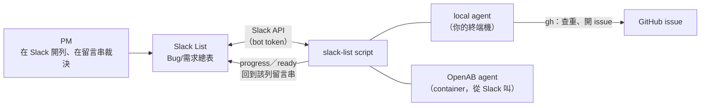

# slack-list：讓 agent 讀寫 PM 的待辦表

PM 和授權使用者把 bug 與需求記在 Slack 的一張 List（**Bug/需求總表**）。這支 skill 讓 agent
讀那張表、讀每一列的留言串、把處理進度回報回去，全部走同一支 script。

教 agent 怎麼用的是 [`skills/slack-list/SKILL.md`](../../skills/slack-list/SKILL.md)，
script 本體是 [`skills/slack-list/scripts/slack-list`](../../skills/slack-list/scripts/slack-list)。

## 全貌



兩個 agent 用的是同一支 script，差在「我是誰」怎麼來、能不能碰 GitHub（見〈兩種跑法〉）。

## 第一次設定

```
建 Slack app → 拿 bot token → 把 List 分享給 app → 填 .env → slack-list env → slack-list count
```

1. **Slack app**：api.slack.com/apps → 你的 app → OAuth & Permissions。scope 至少要讀取的
   `lists:read`；要寫入（`add`、`progress`、`ready`…）再加 `lists:write`、`chat:write`。
   加完 scope 要重新 **Install to Workspace**，token 會換一組新的。
2. **把那張 List 分享給 app**。沒分享的話 token 再對也是 `not_found`。
3. **填 `.env`**。位置在任何 repo 外面，token 不會被 commit：

   ```bash
   mkdir -p ~/.config/slack-list
   cp ~/.claude/skills/slack-list/.env.example ~/.config/slack-list/.env
   chmod 600 ~/.config/slack-list/.env
   ```

   | 變數 | 從哪拿 | 沒填會怎樣 |
   |---|---|---|
   | `SLACK_BOT_TOKEN` | OAuth & Permissions 最上面那串 `xoxb-` | 什麼都跑不了 |
   | `SLACK_LIST_ID` | 在 Slack 打開那張表，從網址列取 | 什麼都跑不了 |
   | `SLACK_MY_USER_ID` | 點自己頭像 → 個人檔案 → 右上「⋮」→ 複製成員 ID（`U` 開頭）。bot token 問不出這個 | `mine` 不能用 |
   | `SLACK_WORKSPACE_URL`、`SLACK_TEAM_ID` | 那張表的網址 `https://<workspace>.slack.com/lists/<TEAM_ID>/<LIST_ID>` | 組不出單列連結 |
   | `PREVIEW_DOMAIN` | 前端分支預覽的網域 | `ready --url` 要自己查網域 |
   | `WORK_HELPER_ISSUE_MODE` | `agent` 或 `manual`（見下） | 預設 `agent` |

   環境變數裡已經有的值優先，所以 container 用 `env_file` 注入時不需要這個檔。
4. **驗**：

   ```bash
   ~/.claude/skills/slack-list/scripts/slack-list env     # 每個值有沒有讀到（token 會遮起來）
   ~/.claude/skills/slack-list/scripts/slack-list count   # 通得到 Slack，回共幾列
   ```

script 不在 PATH 上，要打完整路徑。`.env` 不跟著 script 放，是因為 skill 會被 sync 到好幾個
target，放在 skill 資料夾裡就會有好幾份。

## 兩種跑法

| | local（你的終端機） | OpenAB（container） |
|---|---|---|
| 設定從哪來 | `~/.config/slack-list/.env` | `env_file` 注入的環境變數 |
| 「我」是誰 | `.env` 的 `SLACK_MY_USER_ID` | 每則訊息附的 `openab.sender.v1.sender_id` |

能不能開 GitHub issue 不看在哪跑，看 `WORK_HELPER_ISSUE_MODE`：

| 值 | 用在 | 行為 |
|---|---|---|
| `agent`（預設） | 有 `gh` 權限的地方 | agent 用 `gh` 查重再開 issue |
| `manual` | 沒有 GitHub credential 的地方（例如看不到 private repo 的遠端 agent） | 草稿用 `draft` 交回該列留言串，由人從 GitHub 網頁發布；也不跑 `ready` |

開 issue 前一定先用 Slack 的 record ID 搜一次（`gh issue list --search "Rec0B…" --state all`），
命中就不開。從 Slack 進 GitHub 這段是 agent 在開票，沒有人擋重複。

## 指令

`slack-list <指令> --help` 看參數。

| 類型 | 指令 |
|---|---|
| 讀 | `rows`（主要的查法，可疊加 `--assignee`／`--created-by`／`--where`／關鍵字）、`mine`、`todo`、`replies`（讀留言串）、`context`、`users`（人名 → user ID）、`json` |
| 寫 | `add`（建待辦）、`progress`（留言回報進度，不吵人）、`ready`（通知驗收，狀態改「PM確認中」）、`reporter`（回報對象）、`draft`、`artifact` |
| 查設定 | `env`、`count`、`fields`（有哪些欄、select 能填什麼）、`sample`、`raw` |

兩條規矩 agent 會照 SKILL.md 守，你自己動手時也一樣：

- **`狀態` 欄是 PM 在維護的。** 唯一會寫它的是 `ready`，而且只寫「PM確認中」。
- **`敘述` 欄常常被截斷，真規格在留言串。** 派工或開 issue 前先 `replies <record_id>`。

## 排錯

先 `env`（設定有沒有讀到）再 `count`（通不通得到）。script 會把 Slack 的錯誤碼翻成下面這些：

| 錯誤碼 | 原因 |
|---|---|
| `not_found` / `list_not_found` | `SLACK_LIST_ID` 錯了，或這張表還沒分享給你的 app |
| `invalid_auth` | token 無效：確認是 `xoxb-` 開頭那串，而且 app 已經 Install to Workspace |
| `not_authed` | 沒帶到 token：`.env` 沒被讀到，跑 `env` 看路徑 |
| `missing_scope` | app 少了這個動作要的 scope。加完要重新 Install to Workspace，token 會換一組 |
| `ratelimited` | 被限流（Tier 2，每分鐘 20 次以上），等一下再跑 |
| `missing required field: id` | 想用 API 幫 select 欄加選項。選項只能在 Slack UI 加 |
