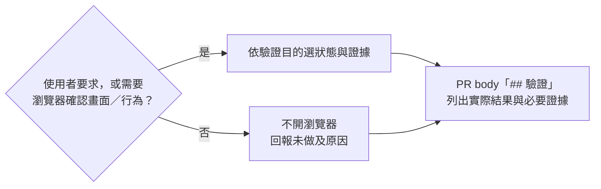

# verify-in-browser：需要時用瀏覽器驗收

使用者要求瀏覽器驗收，或 agent 判斷需要透過畫面／操作確認時，用
[`playwright-cli`](https://github.com/microsoft/playwright-cli) 開 headless Chrome 驗證。
一般 UI 改動不會自動要求瀏覽器驗收；依驗證目的選擇狀態與證據，回報實際結果及未驗項目。

這項觸發與證據原則的研究脈絡及來源限制，見[瀏覽器驗收政策研究記錄](browser-verification-research.md)；分類表是曾考慮的建議，未採用為固定政策。

工具怎麼分工的決定在 dotfiles 的
[ADR 0001](https://github.com/henry5720/dotfiles/blob/main/docs/adr/0001-browser-tools-drive-vs-debug.md)，
調查與 token 實測在
[docs/research/agent-browser-tools.md](https://github.com/henry5720/dotfiles/blob/main/docs/research/agent-browser-tools.md)。

## 為什麼這樣分

| 要做的事 | 用什麼 | skill |
|---|---|---|
| 需要時操作頁面驗證 | `playwright-cli` headless | `verify-in-browser`（自己寫的）＋ `playwright-cli`（官方） |
| 查原因：慢、記憶體、minify 過的錯誤 | chrome-devtools MCP | [`chrome-mcp`](chrome-mcp.md) |
| 你要看著 agent 操作、或要用你桌機的登入狀態 | chrome-devtools MCP 接桌機 Chrome | [`chrome-mcp`](chrome-mcp.md) |
| 值得防回歸的流程 | 寫成該 repo 的 Playwright e2e | — |

官方的 `playwright-cli` 是第三方（`.metadata.json` 記來源），`update` 會蓋掉，所以驗收的規矩另外寫成
`verify-in-browser`，不併進去。`playwright-cli` 的瀏覽器走 pipe，不佔 9222，跟
`chrome-mcp`／`chrome-headless` 可以同時開。

## 什麼時候驗、證據放哪



- 互動 session 和 agent-runner 規則一樣。互動時你說「不用驗」它就跳過；agent 也不會因為改了 UI 就自動啟動驗收。
- 整套回歸交給 CI 和 e2e；選擇瀏覽器驗收時，只做足以回答驗證目的的操作，不要求走遍所有狀態或每個狀態都截圖。
- 選擇附截圖時會上傳到 GitHub，只截測試資料。
- 「每個 PR 都寫驗證段」這條是全域規則，寫在 dotfiles 的 `~/.claude/CLAUDE.md`，不是這支 skill。

## 你要做的事

| 什麼時候 | 做什麼 |
|---|---|
| 新機器 | dotfiles chezmoi 選裝工具勾 `playwright-cli`（用 `headless-chrome` 裝的 Chrome）。WSL、ARM 不裝，agent 會改走 `chrome-mcp` 或把驗收列進「未驗」 |
| 升級 `@playwright/cli` 後 | 官方 skill 釘在跟 CLI 同一版的 commit，要手動跟（見下方） |
| 要 agent 驗需要登入的頁面 | 確認那個 repo 的 `.env` 有帳密（agent 只讀它要的那個 key） |

### 升級 playwright-cli 後跟上 skill

skill 釘在 `microsoft/playwright-cli` 的某個 commit（`.metadata.json` 的 `branch`），跟本機 CLI 同版，
跟 herdr 一樣，避免 skill 寫的指令 CLI 沒有。上游沒打 `v0.1.x` tag，所以釘 commit：找
`chore: mark v<新版>` 那顆。

```bash
playwright-cli --version
gh api 'repos/microsoft/playwright-cli/commits?per_page=20' --jq '.[] | .sha[:12] + " " + (.commit.message | split("\n")[0])' | grep 'mark v'
skillshare install https://github.com/microsoft/playwright-cli.git/skills/playwright-cli --branch <commit> --force && skillshare sync
```

裝好的 skill 應該跟 npm 套件裡帶的一字不差：

```bash
diff -r ~/.config/skillshare/skills/playwright-cli \
  "$(npm root -g)/@playwright/cli/node_modules/playwright-core/lib/tools/skills/playwright-cli"
```

`playwright-cli install --skills` 也能裝，但它寫進當下專案的 `.claude/skills/`，只有 Claude Code
看得到、也不記來源，所以改由 skillshare 裝。

換版後回頭看 `skills/verify-in-browser/SKILL.md` 裡寫著版本號的句子：裸 `snapshot` 印進對話、
`fill` 不加 `--raw` 印出明文、填完密碼後自動存的 snapshot 含明文。新版行為變了就改那幾句和版本號。
